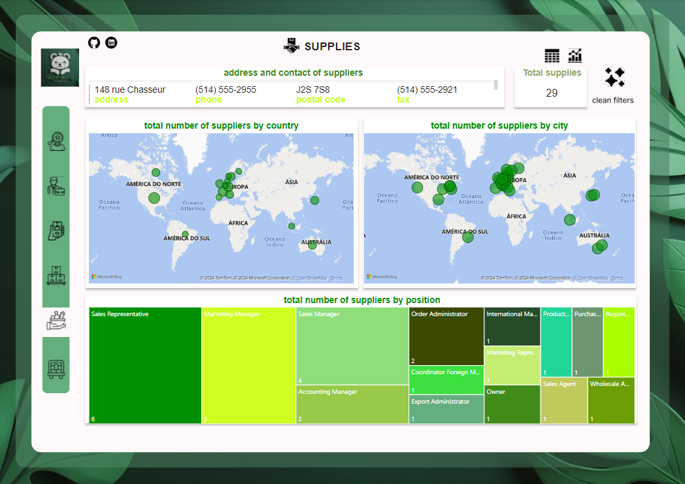

# ANÁLISE DE INDICADORES DA NORTHWIND

 
 <td> </td>
  

## Arquitetura do Projeto

## Introdução
  
Esse projeto tem como objetivo a construção de um relatório feito no power BI com a disponibilização de 14 tabelas da empresa fictícia “Northwind”. Essa empresa enfrenta problemas de gerenciamento e análise de dados que devido a grande demanda e crescimento da loja, os métodos antigos deixaram de ser úteis, então esse projeto tem a função de integrar diferentes áreas em apenas um relatório, assim há uma diminuição de conflitos entre elas e um aumento da performance da loja. E para isso, primeiro foi passado pela etapa de pré-processamento de dados, em que eles foram explorados em um arquivo jupyter notebook, para verificar a integridade e resolver qualquer problema que possa causar no momento das análises, e a outra etapa foi a construção do painel no power BI, contendo 7 páginas que buscam integrar diferentes áreas e gerar insights para os tomadores de decisão. 
* [Link do painel interativo](https://bit.ly/northwindanalytics)

## Tecnologias utilizadas

 
  

## Dados
| Dataset                  | Descrição                                                                                              | Colunas                                                                                                               | Tamanho     |
|--------------------------|--------------------------------------------------------------------------------------------------------|-----------------------------------------------------------------------------------------------------------------------|-------------|
| categories               | Os dados descrevem uma tabela que categoriza produtos com quatro atributos principais.                | `category_id`, `category_name`, `description`, `picture`                                                               | (8, 4)      |
| customer_customer_demo   | Os dados fornecem informações sobre dois atributos principais de uma tabela que identifica clientes.   | `customer_id`, `customer_type_id`                                                                                      | (0, 2)      |
| customers_demographics   | Os dados descrevem os atributos de uma tabela que registra informações sobre tipos de clientes.        | `customer_type_id`, `customer_desc`                                                                                    | (0, 2)      |
| customers                | Os dados fornecem uma descrição dos atributos de uma tabela que identifica clientes e suas informações de contato. | `customer_id`, `Company_name`, `Contact_name`, `Contact_title`, `Address`, `City`, `Postal_code`, `Country`, `Phone`, `fax`, `region` | (91, 11)    |
| employee_territories     | Os dados fornecem informações sobre dois atributos principais de uma tabela que identifica empregados e os territórios aos quais estão associados. | `employee_id`, `territory_id`                                                                                          | (49, 2)     |
| employees                | Os dados fornecem uma descrição detalhada dos atributos de uma tabela que identifica empregados e suas informações pessoais e profissionais. | `employee_id`, `Last_name`, `first_name`, `Title`, `title_of_courtesy`, `birth_date`, `Hire_date`, `Address`, `city`, `region`, `postal_code`, `country`, `Home_phone`, `Photo`, `photo_path`, `Notes`, `reports_to`, `extension` | (9, 18)     |
| order_details            | Os dados descrevem os atributos de uma tabela que registra informações sobre pedidos e produtos.      | `order_id`, `product_id`, `Unit_price`, `Quantity`, `Discount`                                                          | (2155, 5)   |
| orders                   | Os dados fornecem uma descrição detalhada dos atributos de uma tabela que registra informações sobre pedidos de clientes. | `order_id`, `Customer_id`, `Employee_id`, `required_date`, `Order_date`, `Shipped_date`, `Ship_via`, `Freight`, `Ship_name`, `ship_address`, `Ship_city`, `ship_region`, `Ship_Postal_code`, `ship_country` | (830, 14) |
| products                 | Os dados fornecem uma descrição detalhada dos atributos de uma tabela que registra informações sobre produtos. | `product_id`, `Product_name`, `Supplier_id`, `Category_id`, `Quantity_per_unit`, `Unit_price`, `Units_in_stock`, `Units_on_order`, `Reorder_level`, `discontinued` | (77, 10)  |
| region                   | Os dados descrevem os atributos de uma tabela que registra informações sobre regiões.                  | `region_id`, `Region_description`                                                                                       | (4, 2)     |
| shippers                 | Os dados fornecem uma descrição dos atributos de uma tabela que registra informações sobre transportadoras. | `shipper_id`, `Company_name`, `Phone`                                                                                   | (3, 3)     |
| supplies                 | Os dados descrevem os atributos de uma tabela que registra informações detalhadas sobre fornecedores.  | `supplier_id`, `company_name`, `contact_name`, `contact_title`, `address`, `city`, `region`, `postal_code`, `country`, `phone`, `fax`, `homepage` | (29, 12)   |
| territories              | Os dados descrevem os atributos de uma tabela que registra informações sobre territórios.              | `territory_id`, `territory_description`, `region_id`                                                                    | (53, 3)    |
| us_states                | Os dados fornecem uma descrição dos atributos de uma tabela que registra informações sobre estados.    | `state_id`, `state_name`, `state_abbr`, `state_region`                                                                  | (51, 4)    |

##  Requisitos Essenciais e Critérios de Avaliação

| Requisito Essencial                  | Descrição                                                                                                           | Critério de Avaliação                                                                 | Método de Avaliação                                    |
|--------------------------------------|---------------------------------------------------------------------------------------------------------------------|---------------------------------------------------------------------------------------|-------------------------------------------------------|
| Pré-processamento de Dados           | Importar, explorar e limpar dados utilizando Python no Google Colab.                                                | Dados sem valores nulos, formatos consistentes, datasets relevantes selecionados e preparados. | Revisão de código, análise de logs de limpeza de dados, verificação manual das amostras de dados. |
| Construção do Painel no Power BI     | Carregar e organizar dados no Power BI, criando visualizações interativas divididas em seis páginas temáticas mais uma capa. | Painel funcional, visualizações claras e interativas, navegação eficiente entre páginas. | Testes de usabilidade, feedback de stakeholders, verificação da funcionalidade dos botões interativos. |
| Design de Layouts no Figma           | Produzir layouts das páginas do relatório no Figma, utilizando cores da marca e um logotipo fictício, integrando design ao Power BI. | Consistência visual com a marca, layout profissional e integrado ao painel do Power BI. | Revisão do design por equipe de design, comparação com padrões de marca, validação de stakeholders. |
| Geração de Insights                  | Analisar dados e gerar insights acionáveis para apoiar decisões estratégicas, focando em aumentar o ticket médio e reduzir o churn. | Insights relevantes e aplicáveis, suportados por dados, que podem orientar ações estratégicas. | Avaliação de stakeholders, comparação dos insights com objetivos estratégicos, análise de viabilidade das ações sugeridas. |
| Qualidade dos Dados                  | Garantir que todos os datasets utilizados estão em alta qualidade e adequadamente pré-processados antes de serem carregados no Power BI. | Dados sem inconsistências, alta integridade e adequação para análise. | Revisão de qualidade de dados, verificação de integridade, relatórios de limpeza de dados. |
| Interatividade do Painel             | Implementar funcionalidades interativas no painel, como botões para limpar filtros, visualizar tabelas de dados e navegação entre páginas. | Interatividade fluida, fácil de usar, e que melhora a experiência do usuário. | Testes de usabilidade com usuários finais, feedback de usuários, análise de performance das funcionalidades interativas. |
| Documentação do Projeto              | Criar documentação detalhada de todas as etapas do projeto, incluindo pré-processamento, construção do painel e design de layouts. | Documentação clara, detalhada e fácil de seguir, cobrindo todas as etapas do projeto. | Revisão por pares, feedback de novos membros da equipe que utilizam a documentação para entendimento do projeto. |

## Visualização do Painel: 

## Etapas do Desenvolvimento: 

- **Pré-processamento de Dados**:
  - Ferramenta: Python no Google Colab
  - Importação: Importação dos arquivos de dados para o ambiente do Google Colab
  - Exploração: Verificação e tratamento de valores nulos e formatos inadequados
  - Exclusão de Datasets: `customer_customer_demo`, `customer_demographics`, `employee_territories`, `region`, `territories`, `us_states`
  - Formatação de Datasets: `categories`, `order_details`, `shippers` (em bom formato)
  - Tratamento de Valores Nulos: `customers`, `employees`, `orders`, `supplies`
  - Conversão de Formatos: Conversão de valores de data para datetime (`employees`, `orders`), alteração de valor numérico para categórico (`products`)

- **Construção do Painel no Power BI**:
  - Planejamento: Identificação e organização dos dados a serem utilizados
  - Carregamento: Upload dos dados pré-processados no Power BI
  - Criação de Páginas: Desenvolvimento de seis páginas temáticas (customers, employees, orders, products, supplies, shippers) e uma capa
  - Funcionalidades Interativas: Botões para limpar filtros, visualizar tabelas de dados, links para redes sociais, navegação entre páginas

- **Design de Layouts no Figma**:
  - Ferramenta: Figma
  - Layouts: Produção de layouts das páginas do relatório
  - Consistência Visual: Uso de cores da marca e logotipo fictício em tons de verde
  - Integração: Integração do design ao painel do Power BI

- **Geração de Insights**:
  - Análise: Análise dos dados para gerar insights acionáveis
  - Foco Estratégico: Aumentar o ticket médio e reduzir o churn
  - Páginas Temáticas:
    - **Customers**: Identificação de concentração de clientes, potencial de expansão em outras regiões
    - **Employees**: Concentração de empregados, necessidades de expansão de força de trabalho
    - **Orders**: Quantidade de pedidos por região, análise de custos de frete e principais destinatários
    - **Products**: Circulação de produtos, controle de estoque, principais categorias de produtos
    - **Supplies**: Concentração de fornecedores, comunicação e integração com representantes de vendas e gerentes de marketing
    - **Shippers**: Distribuição das transportadoras, formas de contato e integração

- **Documentação do Projeto**:
  - Detalhamento: Documentação detalhada de todas as etapas do projeto
  - Clareza: Explicação clara e fácil de seguir sobre o pré-processamento, construção do painel e design de layouts
  - Revisão: Revisão por pares e feedback de novos membros da equipe

## Capturas das Páginas
<table>
  <tr>
    <td></td>
    <td></td>
  </tr>
</table>

<table>
  <tr>
    <td></td>
    <td></td>
  </tr>
</table>

<table>
  <tr>
    <td></td>
    <td></td>
  </tr>
</table>

## Insights do Painel Interativo

Durante a construção do painel interativo, foram gerados diversos insights que podem impactar positivamente as decisões estratégicas da empresa:

### Página Customers
- **Clientes Concentrados nos EUA**: Estratégia para entender e adaptar a atração de clientes em outros países.
- **Concentração na Europa e Baixa na América do Sul**: Estratégia para atrair mais clientes na América do Sul.
- **Distribuição de Funções**: Maior quantidade de proprietários e representantes de vendas em contato com clientes, menor quantidade de assistentes.

### Página Employees
- **Distribuição de Empregados**: Mais representantes de vendas, pode indicar necessidade de mais empregados ou dados incompletos.
- **Concentração nos EUA e UK**: Possíveis filiais nesses países, correlacionando com maior número de clientes.

### Página Orders
- **Pedidos por Região**: Maior quantidade de pedidos na Europa, seguido pela América do Norte e América do Sul. Necessidade de expansão para outras regiões.
- **Valor do Frete nos EUA**: Maior valor de frete, possivelmente devido ao custo de vida e alta demanda.
- **Principais Destinatários**: Identificação de destinatários com maior quantidade e preço unitário de pedidos, pesquisa para atrair novos fornecedores e melhorar serviços.

### Página Products
- **Distribuição de Produtos**: Menor quantidade de produtos na América do Sul, potencial de mercado em expansão.
- **Produto de Maior Preço**: Thuringer Rostbratwurst com maior preço unitário, alta demanda.
- **Controle de Estoque**: Gestão de produtos encomendados, recebidos e nível de estoque.
- **Categorias Principais**: Carne, confecções e condimentos com maior preço unitário.

### Página Supplies
- **Distribuição de Fornecedores**: Maior concentração na Europa, mercado forte.
- **Contato com Fornecedores**: Mais representantes de vendas e gerentes de marketing em contato com fornecedores, identificação de responsáveis.

### Página Shippers
- **Distribuição de Transportadoras**: Visão da distribuição por companhia e forma de contato, facilitando a comunicação e integração entre áreas.

## Estrutura do repositório:
------------

    ├── requirements.txt          <- O arquivo de requisitos para reproduzir o ambiente de análise, por exemplo, gerado com `pip congelamento > requisitos.txt
    │
    ├── LICENSE
    │
    ├── README.md                 <- O Readme de nível superior para desenvolvedores que usam esse projeto
    │ 
    ├── gifs                      <- contém os gifs da arquitetura do projeto e visualização do painel
    │
    ├── Imagem                    <- Contém a logo do projeto e os layouts das páginas
    │
    ├── relatório                 <- Contém o relatório de indicadores da NorthWind
    │
    ├── power BI                  <- Contém o arquivo power BI do painel interativo
    │   
    ├── Arquivos                  <- Contém os dataset utilizados no projeto, antes e depois do pré-processamento
    │
    └── caderno                   <- caderno jupyter notebook utilizado para o pré-processamento de dados

## Conclusão
Neste projeto, abordamos um conjunto abrangente de etapas que nos permitiram transformar dados brutos em insights acionáveis para a Northwind Traders. Destacou a importância de um pré-processamento de dados robusto, garantindo a qualidade e integridade dos dados para análises subsequentes e o uso do Power BI permitiu criar visualizações interativas e acessíveis, facilitando a compreensão dos dados e a geração de insights e por fim, a integração de design no Figma reforçou a identidade visual da marca, proporcionando uma experiência coesa e profissional. 
Através deste projeto, adquirimos um conhecimento aprofundado sobre as melhores práticas de manipulação e visualização de dados, além de estratégias de análise que podem apoiar decisões empresariais informadas. Esses insights são cruciais para aumentar o ticket médio e reduzir o churn, alinhando-se aos objetivos estratégicos da Northwind Traders.

